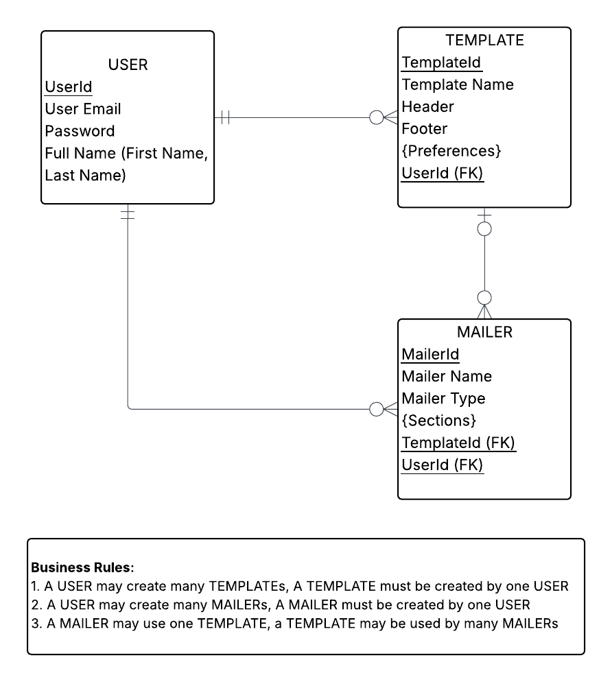
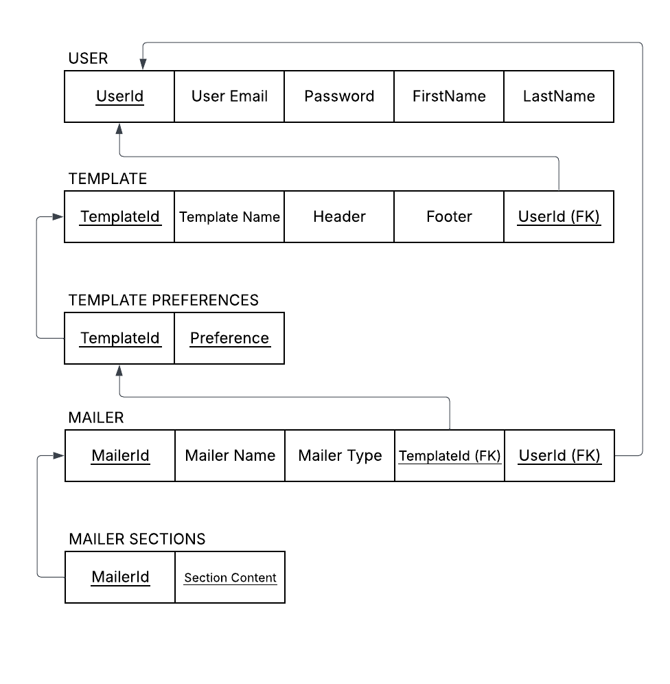

**Web and Database Programming CPS 553**

# Mailer/Newsletter Designer App

The idea of this project is to allow users to create mailer templates for personal or business use. The goal is to avoid hardcoding mailer content while still allowing customizable preferences for newsletters, while keeping the application flexible, easy to modify, and supported by some level of automation and welcoming user experience.

Users will be able to design their own mailer themes as templates, and then create, update, preview, and delete mailers. Each completed mailer will be able to render raw generated HTML/CSS files that are compatible with email marketing platforms.

**Application Logic:**
1. Users will be able to register and login in order to access and manage their stored mailer files and templates.
2. The designer page will have a dynamic UI that allows users to adjust properties that modify CSS in real time, such as fonts, text sizes, color intensity sliders, padding, margins, dropdown menus, number of columns, etc.
3. The design interface will include a display window that takes up 2/3 of the screen and allows for mobile and desktop preview for easy testing. The left side of the screen will contain clearly organized, readable properties that users of varying experience levels can intuitively understand and modify.
4. A user can optionally input content such as product data or promotional material to populate the template.

The minimum expectation for completion of the project in the context of this course will primarily be to allow users to register and login, access their mailer files and templates, create, edit, update, and delete mailers, and introduce basic functionality of the designing process.

## Entity Relation Diagram (ERD)

This project will consist of 3 total entities. A user will be able to create email templates, then create mailers using their own pre-built templates. The ERD below showcases how these 3 entities will connect to each other.

## Relations (3NF)

The Relations Diagram below in Third Normal Form removes redundancies and splits the entity multi-valued attributes, such as Sections and Preferences, into separate object types.

